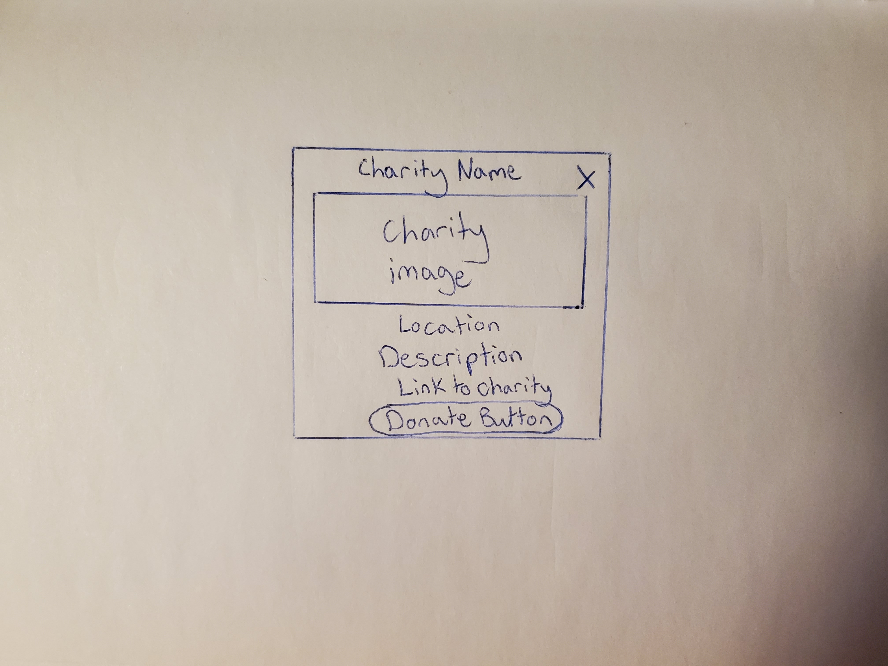

# Project Title

I Want to Help

## Overview

What is your app? Give a brief description in a couple of sentences.

I Want to Help is a place for people to find information about charities releated to causes they're passionate about.

### Problem Space

Why is your app needed? Give any background information around any pain points or other reasons.

If a website dedicated to raising money about a cause is easy to navigate people are more likely to use it.
Researching charities can be a long and tedious process. People looking to donate to a charity typically have to search through different websites and decide on the best one. This is a way to simplify that search and make these charities easily accessible in one place, while exposing users to charities they were not aware of.

### User Profile

Who will use your app? How will they use it? Add any special considerations that your app must take into account.

The ideal candidate for my website is someone who wants to make a difference and has money to give. If they don't know where to start, they can search for a cause they care about on this website and decide on the best one to donate to.

### Features

List the functionality that your app will include. These can be written as user stories or descriptions with related details. Do not describe _how_ these features are implemented, only _what_ needs to be implemented.

- As a user, I want to be able to search for a cause
- As a user, I want to be able to see a list of charities related to that cause
- As a user, I want to be able to see details about a specific charity, and visit their website

## Implementation

### Tech Stack

List technologies that will be used in your app, including any libraries to save time or provide more functionality. Be sure to research any potential limitations.

- React
- Express
- Client libraries:
  - react
  - react-router
  - axios
- Server libraries:
  - knex

### APIs

List any external sources of data that will be used in your app.

https://docs.every.org/docs/intro

### Sitemap

List the pages of your app with brief descriptions. You can show this visually, or write it out.

- Home page - Cause buttons, search bar to filter results, results from API with modals onClick

- About page - How to use the website, Why I made the website, Tech Stack, API

### Mockups

Provide visuals of your app's screens. You can use pictures of hand-drawn sketches, or wireframing tools like Figma.

### Data

Describe your data and the relationships between the data points. You can show this visually using diagrams, or write it out.

### Endpoints

List endpoints that your server will implement, including HTTP methods, parameters, and example responses.

Get details about a nonprofit: GET /v0.2/nonprofit/:identifier
Browse nonprofits: GET /v0.2/browse/:cause

## Roadmap

Scope your project as a sprint. Break down the tasks that will need to be completed and map out timeframes for implementation working back from the capstone due date.

---

- Create client

  - react project with routes and boilerplate pages

- Create server

  - express project with routing, with placeholder responses

- Deploy client and server projects so all commits will be reflected in production

- Feature: List results from a given search

  - Use GET endpoint

- Feature: Home page

- Get results from API call

- Filter results using search bar

- Feature: About Page

  - Credits/Purpose of website

- Bug fixes

- DEMO DAY

## Future Implementations

Your project will be marked based on what you committed to in the above document. Here, you can list any additional features you may complete after the MVP of your application is built, or if you have extra time before the Capstone due date.

Share buttons
Authentication
